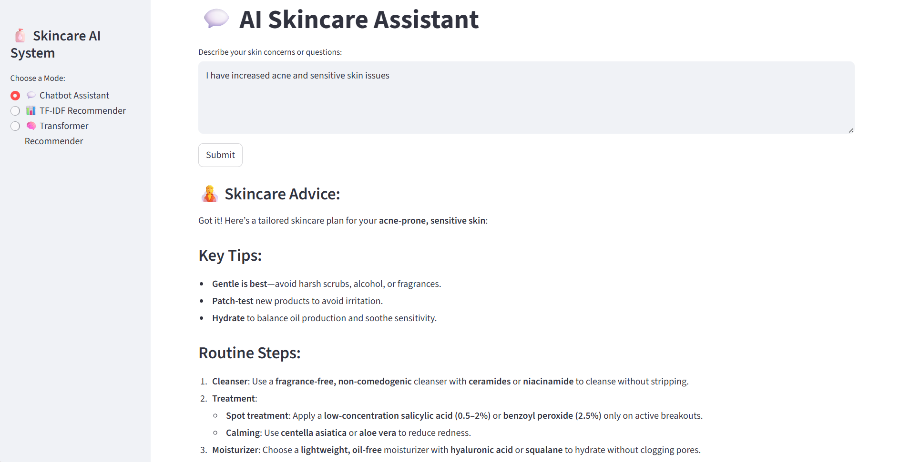

# 🧴 Skincare AI System – NLP-Based Recommendation Engine

This project is an NLP-based Skincare Recommendation System developed as part of coursework, designed to demonstrate practical applications of Natural Language Processing in real-world product recommendation scenarios.  
It integrates traditional NLP techniques with transformer-based semantic search and provides an interactive user interface using Streamlit.

---

## 🚀 Project Overview

The system supports **three different modes**:

### 1️⃣ Skincare Chatbot Assistant
- A conversational assistant that answers general skincare-related questions.
- Powered by an LLM (Mistral) to provide contextual skincare guidance.
- Accepts free-text user queries.

---

### 2️⃣ TF-IDF Based Product Recommender
Recommends skincare products using traditional NLP techniques.

**User Inputs:**
- Product category (e.g., sunscreen, BB/CC creams)
- Skin concerns (text description)
- Preferred price range
- Minimum product rating

**Methodology:**
- TF-IDF vectorization of product descriptions and user queries
- Cosine similarity for ranking
- Filters applied on price, rating, and category
- Returns **Top 3 relevant products**

---

### 3️⃣ Transformer-Based Recommender (SBERT)
A semantic recommendation engine using sentence embeddings.

**Model Used:**
- `all-MiniLM-L6-v2` (Sentence-BERT)

**User Inputs:**
- Product category
- Skin concerns (natural language)
- Minimum rating

**Methodology:**
- Sentence embeddings for products and user queries
- FAISS for efficient similarity search
- Semantic matching beyond keyword overlap
- Returns **Top 3 recommendations**

---

## 🧠 Technologies Used

- **Python**
- **Streamlit** (Application UI)
- **Natural Language Processing**
- **TF-IDF (Scikit-learn)**
- **Sentence-BERT (`all-MiniLM-L6-v2`)**
- **FAISS** for efficient similarity search in the transformer-based recommender.
- **Mistral LLM** (Chatbot mode)
- **NumPy / Pickle**
- **Git LFS** for large model files

---

## 📊 Dataset

- **Source:** Sephora Products & Skincare Reviews  
- **Platform:** Kaggle  
- **Link:** https://www.kaggle.com/datasets/nadyinky/sephora-products-and-skincare-reviews  

The dataset includes:
- Product names
- Descriptions
- Ingredients
- Prices
- Ratings and reviews
- Category information

---

## 🗂️ Project Structure

skincare_initial/
│── app.py # Streamlit application
│── Model.ipynb # Model training & experimentation
│── validate_model.py # Validation utilities
│── product_info.csv # Product metadata
│── skincare_only.csv # Filtered skincare dataset
│── tfidf_vectorizer.pkl # TF-IDF vectorizer
│── tfidf_matrix.pkl # TF-IDF matrix
│── sbert_model.pkl # SBERT model
│── sentence_model/ # Transformer model files
│── faiss_index.idx # FAISS index
│── product_embeddings.npy # Embeddings
│── README.md # Project documentation


---

## ▶️ How to Run the Project

### 1️⃣ Clone the repository
```bash
git clone https://github.com/pranavyabaskar-cmyk/SKINCARE_INITIAL.git
cd SKINCARE_INITIAL

### 2️⃣ Install dependencies
```bash
pip install -r requirements.txt

### 3️⃣ Run the application
streamlit run app.py


## 🖼️ Application Screenshots

### Skincare Chatbot Assistant


### TF-IDF Based Recommender (Input)


### Recommendation Output

